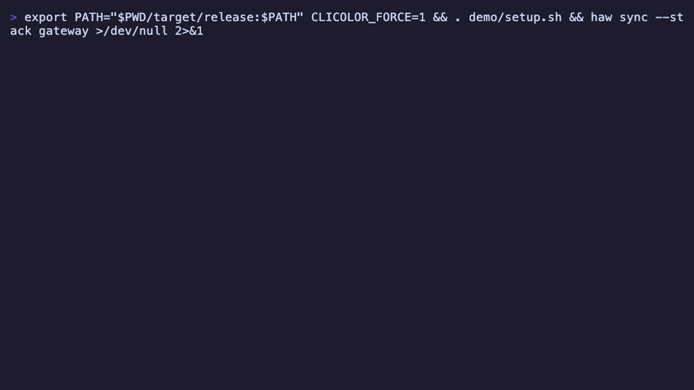

# 6. Build, test, and verify

You can compose a fleet, pin it, and ship changesets across it. Now let's make it *earn its
keep* day to day. The promise of a multi-repo tool is simple: do something across every
repo at once, in parallel, without a hand-rolled `for` loop — and then gate the whole fleet
so CI stays green.

In this chapter you'll run arbitrary commands across the fleet, wire up `build` and `test`,
search every repo in one shot, and use `verify` as the drift gate that ties it together.
Keep the `my-first-stack` workspace open.


*One command in, the whole fleet processed in parallel — no hand-rolled `for` loop.*

<div class="objectives">
<strong>🎯 In this chapter, you'll learn to…</strong>
<ul>
<li>Fan any command across every repo with <code>haw run</code>.</li>
<li>Declare <code>build =</code> / <code>test =</code> per repo and drive the whole fleet with <code>haw build</code> / <code>haw test</code> — live-streamed, per-repo color.</li>
<li>Search every repo at once with <code>haw grep</code>.</li>
<li>Gate the fleet against the lock with <code>haw verify</code> — the CI drift gate.</li>
<li>Control the blast radius with <code>-j</code> (parallelism) and <code>--group</code> (scope).</li>
</ul>
</div>



*`haw run` fans a command across every repo in parallel; `verify` gates the fleet against the lock.*

## ⚙️ 1. Run any command across every repo — `haw run`

The workhorse. `haw run` takes a command *positionally* and runs it in every repo, in
parallel:

```bash
haw run 'git log -1 --oneline'
```

```console
── hello-world ──
7fd1a60 Merge pull request #6 from Spaceghost/patch-1
── spoon-knife ──
d0dd1f6 Pointing to the guide for forking
ran in 2/2 repos
```

`haw` groups the output per repo so you always know which repo said what. Anything you'd
type in one repo works: `git fetch`, `git status -s`, a linter, a shell one-liner.

<div class="callout tip">

**Tip:** Quote the command. `haw run 'git status -s'` passes the whole string as one
command; without quotes your shell would try to interpret the flags itself.

</div>

## 🔨 2. Declare build and test — then run them fleet-wide

`haw` stays build-system-agnostic: each repo names the shell command that builds or tests
*it*, and `haw` fans those out. You declare them in the manifest with `build =` and
`test =`.

In the real world each repo brings its *own* toolchain. Here's the shape, from the
shipped [`microservices`](https://github.com/Nastwinns/hawser/tree/main/examples/microservices)
example:

```toml
[repo.proto]
build = "buf generate"
test  = "buf lint"

[repo.gateway]
build = "go build ./..."
test  = "go test ./..."

[repo.billing]
build = "cargo build --release"
test  = "cargo test"

[repo.accounts]
build = "npm ci && npm run build"
test  = "npm test"
```

Our octocat repos have nothing real to compile — and if you run `haw build` now, it
tells you so and exits non-zero:

```console
$ haw build
error: no cloned repo declares a `build` command in the manifest
```

So let's declare trivial commands to see the mechanism. Add a `build =` and `test =`
line to **both** repos in your `my-first-stack/haw.toml`:

```toml
[repo.hello-world]
remote = "gh"
repo = "Hello-World.git"
rev = "master"
groups = ["core"]
build = "echo built"
test  = "echo tested"

[repo.spoon-knife]
remote = "gh"
repo = "Spoon-Knife.git"
rev = "main"
groups = ["web"]
build = "echo built"
test  = "echo tested"
```

Now two commands drive the whole fleet:

```bash
haw build     # runs every repo's `build =`, in parallel
haw test      # runs every repo's `test =`, in parallel
```

```console
$ haw build
── hello-world ──
built
── spoon-knife ──
built
build ran in 2/2 repos
```

Output is **live-streamed** as each repo runs and grouped under a per-repo header, so on a
color terminal each repo's stream carries its own color — you can read a fleet-wide build
without losing track of which repo produced which line. Repos that don't declare the
command (or aren't cloned) are simply skipped. And here's the detail that makes this a CI
building block:

<div class="callout note">

**CI building block:** `haw build` and `haw test` **exit non-zero if any repo fails**.
That's why the same command you run locally drops straight into a pipeline — the pipeline
stops when any repo's build breaks.

</div>

## 🔎 3. Search the whole fleet — `haw grep`

Need to find every use of a symbol, a TODO, a deprecated API across *all* repos? `haw
grep` fans `git grep` across every cloned repo at once:

```bash
haw grep guide
```

```console
spoon-knife (1 hit(s))
  README.md:9:For some more information on how to fork a repository, [check out our guide, "Forking Projects""](http://guides.github.com/overviews/forking/). Thanks! :sparkling_heart:
1 hit(s) in 2 repo(s) for `guide`
```

Each repo with a match gets a header and its hits underneath, and a final line
totals the hits and repos searched — a repo with no match just doesn't appear. It
searches tracked files via Git, so it's fast and ignores your build artifacts for
free. Scope it to one stack with `--stack <name>` when the fleet is large.

## 🛡️ 4. Verify — the CI gate

Building and testing green is only half the story. Before any of it, CI must prove the tree
is *the one you pinned* — no drift from `haw.lock`. That's `haw verify`, which you met in
Chapter 3:

```bash
haw verify; echo "exit code: $?"
```

```console
verified: tree matches haw.lock (2 repos)
exit code: 0
```

`verify` asserts the on-disk tree matches the lock and **exits 3** on drift — a clean,
scriptable gate. It's the first real step of every pipeline: sync to the lock, `verify`
you're on it, *then* build and test. Chapter 7 wires the full `sync → verify → build →
test` job.

<div class="callout tip">

**Tip:** `verify` reads the tree and the lock only — no network, no builds. It's cheap
enough to run as a git pre-commit hook (`haw hooks install`) so drift never even reaches
CI.

</div>

## 🎚️ 5. Control the blast radius: parallelism and groups

Two levers keep fleet-wide commands under control.

**Parallelism — `-j`.** By default `haw` runs up to `min(cores, 8)` repos at once. Cap it
when a task is heavy (or a CI runner is small):

```bash
haw test -j 4     # at most 4 repos building/testing at a time
haw run -j 1 'git fetch'   # fully serial
```

**Groups — `--group`.** Remember the `groups = [...]` labels from your manifest? They
exist precisely so you can act on a slice of the fleet. In `my-first-stack`, `hello-world`
is in group `core` and `spoon-knife` is in `web`:

```bash
haw status --group core
```

```console
REPO         BRANCH                   HEAD       DIRTY  DRIFT
hello-world  master                    7fd1a60b   -      -
```

Only the `core` repo. The same `--group` filter works on `sync`, `status`, and `run` (and
`build`/`test`), and it's *repeatable* — pass it twice to select two groups. An empty
filter means everything; a filter excludes ungrouped repos.

```bash
haw run --group core 'git log -1 --oneline'   # only core repos
```

## 🗺️ 6. When to reach for each

A quick map so you pick the right verb without thinking:

| You want to… | Use | Why |
|---|---|---|
| run an ad-hoc command everywhere | `haw run '<cmd>'` | one-off, not part of the manifest |
| build the whole product | `haw build` | runs each repo's declared `build =`, CI-ready exit code |
| test the whole product | `haw test` | runs each repo's declared `test =`, fails on any failure |
| prove the tree matches the lock | `haw verify` | drift gate, exit 3 on drift |
| find text across all repos | `haw grep <pat>` | fleet-wide `git grep`, grouped output |
| limit to part of the fleet | add `--group <g>` | act on a labeled slice |
| tame a heavy or CI run | add `-j <n>` | cap concurrent repos |

The rule of thumb: **`run` for one-off commands, `build`/`test` for the commands your repos
declare, `verify` to gate.** The declared ones are the ones you'll want identical locally
and in CI.

<div class="your-turn">
<strong>🙌 Your turn</strong>
<p>Put the fleet through its paces in <code>my-first-stack</code>:</p>
<ul>
<li>Add the trivial <code>build =</code> / <code>test =</code> lines above, then run <code>haw build</code> and <code>haw test</code> — watch the per-repo streamed output and the <code>2/2 repos</code> summary.</li>
<li>Run <code>haw grep guide</code> across the fleet (a real hit in <code>spoon-knife</code>). Then narrow it: <code>haw run --group core 'git log -1 --oneline'</code> — only the <code>core</code> repo should answer.</li>
<li>Run <code>haw verify; echo $?</code> and confirm exit <code>0</code> on a clean tree. Force it fully serial with <code>haw run -j 1 'git status -s'</code> and watch the repos process one at a time.</li>
</ul>
</div>

## ✅ Recap

- `haw run '<cmd>'` runs any command in every repo in parallel, output grouped per repo.
- Declare `build =` / `test =` per repo; `haw build` / `haw test` fan them out,
  live-stream per-repo output, and **exit non-zero on any failure** — so they double as CI
  steps.
- `haw grep <pattern>` is a fleet-wide `git grep`.
- `haw verify` gates the tree against `haw.lock` (**exit 3** on drift) — the first move of
  every pipeline.
- `-j N` caps parallelism; `--group G` (repeatable) scopes commands to labeled repos.

## 👉 Next

You can build, test, and gate the fleet locally. Now let's make all of it production-grade
— trust, CI, signing, and audit → [7. Going to production](07-going-to-production.md).
