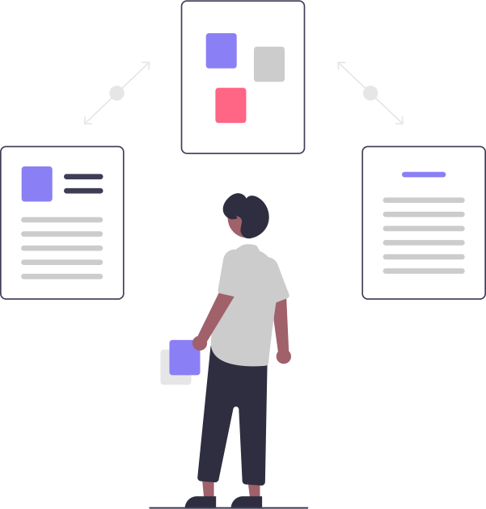

# 6. Plugins and extending

`haw` is designed to become the *central hub* of your multi-repo workflow — and you grow
it **without forking**. In this chapter you'll discover plugins, install one, and scaffold
your very own in the language of your choice. It's easier than you'd expect: a plugin is
just a program that reads some JSON and prints some JSON.


*Reach for the toolbox — you extend `haw` in any language, no fork required.*

<div class="objectives">
<strong>🎯 In this chapter, you'll learn to…</strong>
<ul>
<li>Understand the dispatch rule: any unknown <code>haw &lt;name&gt;</code> runs <code>haw-&lt;name&gt;</code> from your <code>PATH</code>.</li>
<li>Discover and install plugins with <code>haw plugins list</code> and <code>haw plugins install</code>.</li>
<li>Scaffold a runnable plugin in Rust, Python, Go, or shell with <code>haw plugins new</code>.</li>
<li>Read the tiny contract: context in (<code>haw.plugin/1</code>), report out (<code>haw.plugin.report/1</code>).</li>
<li>Subscribe a plugin to <strong>lifecycle phases</strong> so it fires automatically.</li>
</ul>
</div>

## 🧩 1. The idea: `haw <name>` runs `haw-<name>`

`haw` follows the same pattern as `git`, `cargo`, and `kubectl`: **any subcommand `haw`
doesn't recognize is dispatched to a `haw-<name>` executable on your `PATH`.**

```bash
haw jira sync      # not built in → runs `haw-jira sync`
haw bazel-graph    # runs `haw-bazel-graph`
```

Two things make this safe and simple:

- The plugin runs as a **separate process** — a broken or hanging plugin can *never* crash
  `haw`.
- `haw` hands it the current fleet as JSON, and the plugin's exit code becomes `haw`'s. A
  20-line script is a perfectly valid plugin.

## 🔌 2. Discover and install plugins

`haw plugins` (plural) is the management surface. Start by listing what exists:

```bash
haw plugins list
```

```console
NAME        STATUS     SUBSCRIBED    DESCRIPTION
artifact    available  -             SLSA/in-toto provenance + cosign/minisign signing
aspice      installed  pre-request   ASPICE/qualification traceability from the pinned fleet
compliance  available  post-build    SBOM (CycloneDX + SPDX) generation
```

`STATUS` is `installed` when the `haw-<name>` binary is on your `PATH`, else `available`.
Reach past your machine into the **community index** with `--remote`:

```bash
haw plugins list --remote
```

Install a first-party or community plugin (it shells out to `cargo install`):

```bash
haw plugins install aspice            # installs the haw-aspice binary
haw plugins install aspice --dry-run  # print the command, run nothing
```

<div class="callout tip">

**Tip:** `haw` prints exactly the `cargo install …` command before it runs it, and
`--dry-run` shows you the command without executing. Curious where `haw` looks for
plugins? `haw plugins path` lists the `PATH` directories it scans.

</div>

## 🏗️ 3. Scaffold your own — `haw plugins new`

Here's the fun part. Let's build a plugin called `mycheck` in Python:

```bash
haw plugins new mycheck --lang python
```

```console
created ./haw-mycheck/
  haw-mycheck   (executable, python3)
  README.md
next steps:
  chmod is already set — drop it on PATH:
  PATH="$PWD/haw-mycheck:$PATH" haw mycheck
```

You get a **runnable** skeleton that already implements the whole contract: it reads the
fleet context, handles `--help` and `--format json`, emits a report, and behaves sensibly
outside a workspace. Other languages work the same way:

```bash
haw plugins new mycheck --lang shell    # POSIX sh, already executable
haw plugins new mycheck --lang go       # main.go + go.mod → go build
haw plugins new mycheck --lang rust     # cargo crate → cargo build --release
```

Put it on `PATH` and it's instantly a `haw` subcommand:

```bash
PATH="$PWD/haw-mycheck:$PATH" haw mycheck
```

```console
haw-mycheck: inspected 2 repo(s) in /path/to/my-first-stack
```

That's it — you extended the CLI, no fork, no rebuild of `haw`.

## 📜 4. The contract: context in, report out

Every plugin speaks the same tiny protocol. Understand these two shapes and you can write
a plugin in any language.

**Context in — `haw.plugin/1`.** When it dispatches, `haw` passes the current fleet to
your plugin **two ways** (identical content — read whichever is convenient): in the
`HAW_JSON` environment variable, and on **stdin**.

```json
{
  "schema": "haw.plugin/1",
  "root": "/path/to/workspace",
  "stack": "gateway",
  "repos": [
    { "name": "kernel", "path": "/…/kernel", "rev": "v6.1.2", "groups": ["firmware"] }
  ]
}
```

Check `schema` first, then read `root` and `repos`. Run *outside* a workspace, the context
degrades to just `{ "schema": "haw.plugin/1" }` — a well-behaved plugin handles that
gracefully (print help, or exit cleanly).

**Report out — `haw.plugin.report/1`.** Your plugin prints its findings to stdout as JSON
(under `--format json`), and — crucially — **exit codes carry meaning**: `0` is success,
non-zero is failure, and `haw` propagates it. That's what lets a plugin act as a CI gate or
a `&&` link in a chain.

The golden rules, in one breath: name it `haw-<verb>`; be self-describing via `--help`;
human text on stdout, JSON under `--format json`; **fail open** (handle the workspace-less
context); and never hang.

## ⚡ 5. Lifecycle hooks — plugins that fire automatically

Beyond typing `haw <name>`, a plugin can subscribe to **lifecycle phases** in the manifest,
so it runs automatically around fleet operations.



*Hook a plugin into a phase, and it fires on its own — no one has to remember to run it.*

This is exactly how the automotive example wires governance:

```toml
[plugins]
misra  = ["pre-request"]    # block a PR that fails the MISRA C check
aspice = ["post-land"]      # record traceability as the change lands
```

Now `misra` runs before any PR opens, and `aspice` runs after a changeset lands — no one
has to remember to invoke them. `haw`'s own governance features (SBOM, signing, secret
gate) ship *as plugins* on exactly this model, so nothing here is second-class.

<div class="callout tip">

**Tip:** A plugin's report surfaces in the cockpit's **governance view** (`v`) and its
panel in the **Plugins view** (`P`) — whether the hook fired from the CLI or the TUI.

</div>

## 📤 6. Publish it to the community

Built something useful? Share it in two steps:

1. Make the binary installable — publish a crate named `haw-<name>` (users get it with
   `cargo install haw-<name>`), or just ship the executable.
2. Open a PR adding one line to the community index
   ([`plugins-index.json`](https://github.com/Nastwinns/hawser/blob/main/plugins-index.json)):
   its `name`, `crate`, `git`, and a one-sentence `description`. Once merged, it shows up
   for everyone running `haw plugins list --remote`.

## 📚 Where to go deeper

- The full contract, the render intent, and every field: [Plugins](../PLUGINS.md).
- The **official JSON Schemas** (the source of truth for every field):
  [`schemas/`](https://github.com/Nastwinns/hawser/tree/main/schemas).
- Thin reference **bindings** so you don't hand-roll JSON — Python and Go:
  [`bindings/`](https://github.com/Nastwinns/hawser/tree/main/bindings).

## ✅ Recap

- Any unrecognized `haw <name>` runs `haw-<name>` from `PATH`, as a separate process — a
  plugin can't crash `haw`.
- `haw plugins list [--remote]` discovers; `haw plugins install <name>` installs; `haw
  plugins new <name> --lang <l>` scaffolds a runnable skeleton in Rust/Python/Go/shell.
- The contract is tiny: **context in** (`haw.plugin/1` via `HAW_JSON` + stdin), **report
  out** (JSON on stdout, meaningful exit code). Fail open; never hang.
- Subscribe a plugin to **lifecycle phases** in `[plugins]` so it fires automatically.
- Publish via a crate + a one-line PR to the community index.

<div class="your-turn">
<strong>🙌 Your turn</strong>
<p>Write a real plugin — it takes about five minutes:</p>
<ul>
<li>Run <code>haw plugins new mycheck --lang shell</code> (or <code>--lang python</code> if you prefer). Open the generated <code>haw-mycheck</code> and read how it parses the context.</li>
<li>Put it on <code>PATH</code> and run it inside <code>my-first-stack</code>: <code>PATH="$PWD/haw-mycheck:$PATH" haw mycheck</code>. It should report the repos it inspected.</li>
<li>Add one line that counts the repos and <code>exit 1</code> if there are fewer than two — then confirm <code>haw</code> propagates that exit code with <code>echo $?</code>. That's a CI gate you just wrote.</li>
</ul>
</div>

## 👉 Next

You can compose, orchestrate, ship changesets, and extend `haw`. Let's make it
production-grade — trust, CI, signing, and audit → [7. Going to production](07-going-to-production.md).
